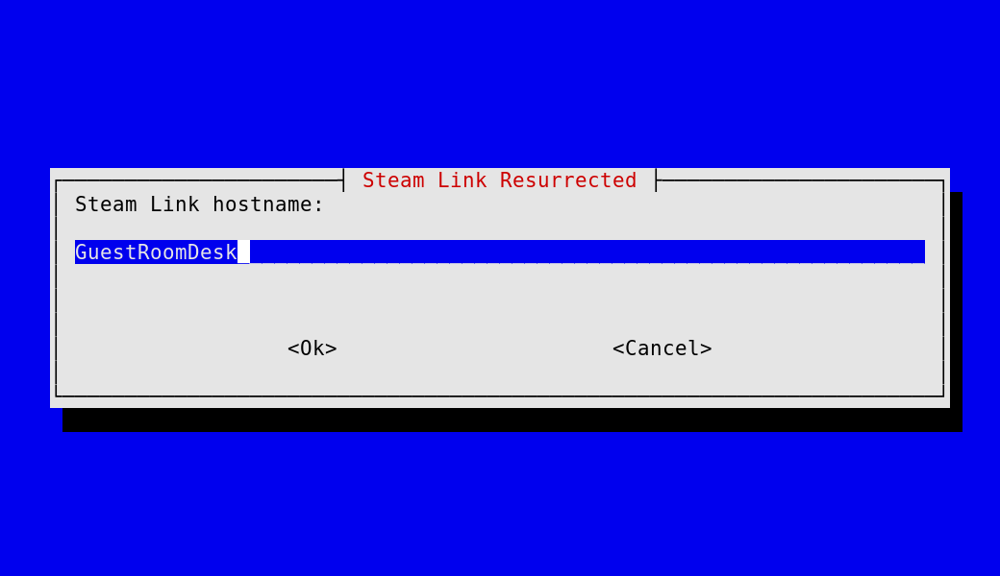
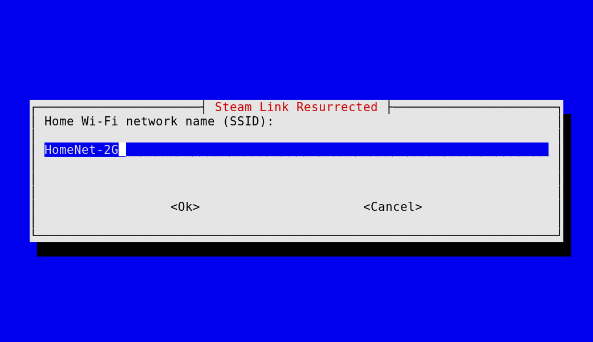
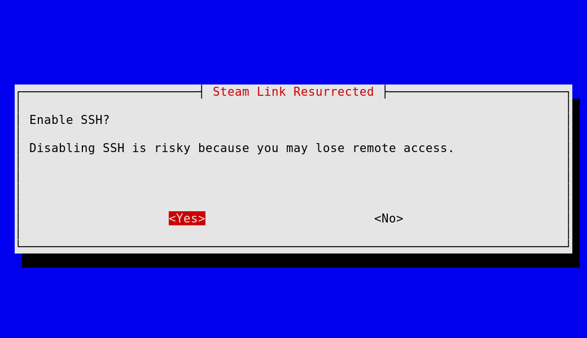
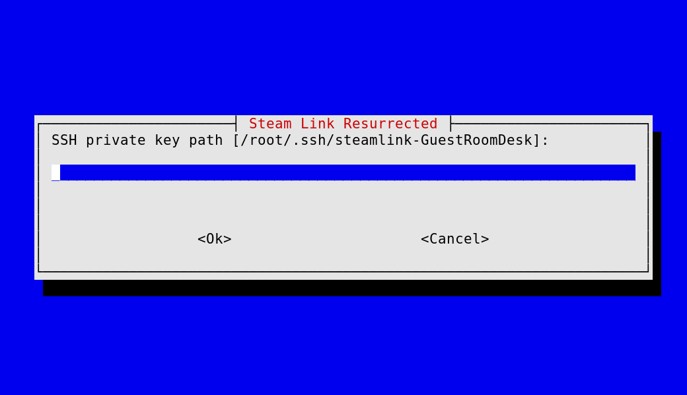
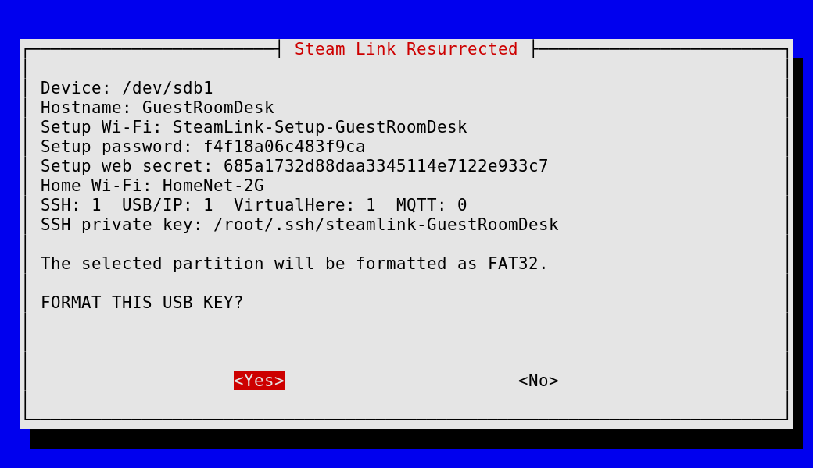
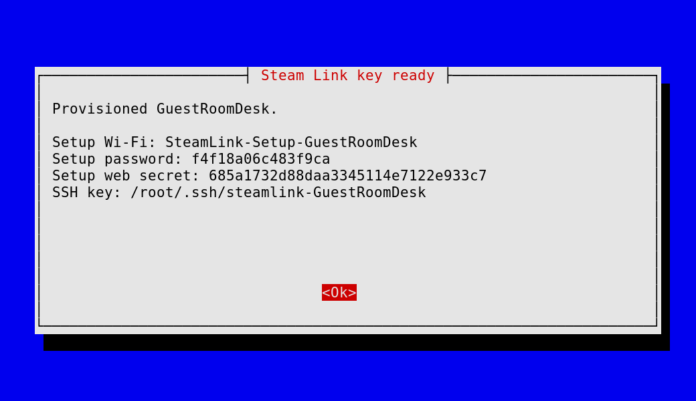

# Steam Link Resurrected

This is a simple project to share what I use for the steamlinks at home. 
They are very old but I wanted to use them as stations for the various desks I have at home. 
The list of features is more or less this

- standard Steam Link SSH/bootstrap support, this is the standard boostrap process you might be accustomed to;
- device-local hostname configuration;
- USB/IP server and supervisor, this is super useful to use esp32 and similar through the steam link to an host;
- the ESPHome Linux Bluetooth proxy;
- active ESPHome Bluetooth GATT connections (service discovery, reads, writes,
  descriptor operations, and notifications);
- authenticated native ESPHome OTA for the BLE proxy binary;
- the Steam Link bundled VirtualHere server.
- the idle power timeout is disabled because the firmware otherwise kills the
  services after roughly 993 seconds;


Standard features of the Steamlink are still working!

## Layout

The `steamlink/` tree is copied to a FAT32 USB key. `scripts/provision-key.sh`
copies files, writes the device-local hostname, and generates a checksum manifest.
Keep the key inserted: the Steam Link can lose these customizations when it is
removed or after power loss. FAT32 does not store Unix permissions, so
`chmod 600` on device secrets is a no-op on the key; anyone with the stick
can read `setup.conf`, `steamlink-ota.conf`, and `authorized_keys`.

The public tree contains only examples. The real files below are generated for
each device and are ignored by Git:

```text
steamlink/overlay/mnt/config/steamlink-usbip.conf
steamlink/overlay/mnt/config/steamlink-ota.conf
steamlink/overlay/mnt/config/setup/setup.conf
steamlink/overlay/mnt/config/ssh/authorized_keys
steamlink/overlay/mnt/config/ble-proxy/ble-proxy.conf
```

When SSH is enabled, the TUI creates a dedicated Ed25519 keypair on the
machine running the bootstrap. It seeds only the public key into the device
path /mnt/config/ssh/authorized_keys and shows the private-key path and
first-login command at the end. The private key is never copied to the USB key.

## Startup scripts

`steamlink/overlay/etc/init.d/startup/` holds the boot hooks copied onto the
device. `S99steam` is the late anchor that runs the others on the very first
boot, before they are picked up by the stock startup glob.

Several are inert unless something opts them in, so a device that does not want
them needs no edits:

| Script | Runs when |
| --- | --- |
| `S03steamlink-boot-watchdog.sh` | `/mnt/config/system/enable_lan_factory_reset_watchdog.txt` exists |
| `S95wifi-watchdog.sh` | ConnMan has a wifi service *and* the default route is on a wireless interface |
| `S96steamlink-device-status.sh` | `/mnt/config/usb-proxy/usb-proxy.conf` is non-empty |
| `S99steamlink-diagnostics.sh` | `ENABLE_DIAGNOSTICS=1` in `setup.conf` |
| `S99vhusbd.sh` | `ENABLE_VIRTUALHERE=1` in `setup.conf` |

`S95wifi-watchdog.sh` is for boxes whose uplink is WiFi, where the wired port is
no longer a management path. It derives the ConnMan service, uplink interface
and gateway at runtime, so it carries no addresses or SSIDs; override with
`WIFI_WATCHDOG_SVC`, `WIFI_WATCHDOG_UP` or `WIFI_WATCHDOG_GW` in `setup.conf`.
It escalates reconnect -> restart connmand -> reload the wifi stack -> reboot
(rate limited to once an hour) and logs every transition to
`/mnt/config/log/wifi-watchdog.log`. **Read that log rather than assuming it
recovers fine** -- regular level-3 escalations mean a real fault that wants
fixing at the source.

`S99steam` does not invoke `S95wifi-watchdog.sh` or
`S96steamlink-device-status.sh` on the first boot; both start from the second
boot onward, once the stock glob sees them.

## TUI screenshots

These are captures of `sudo ./launch.sh` actually running: real whiptail
dialogs, in this order. The values shown come from one throwaway demo run, so
the secrets in them are not usable.

The builder starts with the device identity and the home network it should
join:





SSH is opt-in, and when it is enabled the builder asks where to write the
device-specific private key on this machine:





Nothing is written until the final confirmation, which repeats the generated
setup AP credentials and web secret before the partition is formatted:



When the key has been written and verified, the access details are shown once:



## Building a key

The interactive builder is launched with:

    sudo ./launch.sh /dev/sdb1

It requires whiptail, lsblk, mkfs.vfat, openssl, and ssh-keygen. Pass a
removable partition such as /dev/sdb1, not a whole disk. The launcher refuses
non-removable or mounted partitions. USB diagnostic snapshots are off unless
you enable them; they write to the key every 15 seconds.

On first boot, use the setup AP credentials shown by the TUI and open
http://192.168.42.1/. The setup web login is username admin and the generated
web secret; disable the setup web when finished.

## Provisioning

Run with a unique secret for each physical device:

```sh
STEAMLINK_OTA_PASSWORD='generate-a-long-random-secret' \
STEAMLINK_ENABLE_SSH=0 \
  scripts/provision-key.sh /mnt/steamlink-key SteamLinkOffice
```
The password is read only from the environment, written to the device-local
configuration, and never committed. The script does not delete unrelated files
from the key. Review the generated manifest before ejecting it.

## Optional add-ons

For optional native status reporting, provide an overlay directory and MQTT
configuration explicitly.

The bootstrap repository is the authoritative base USB-key builder. Add-ons
are separate overlay packages and are layered explicitly during provisioning.
For an optional native Steam Link USB status reporter overlay, provide an
overlay directory and MQTT configuration explicitly:

```sh
STEAMLINK_OTA_PASSWORD='...' \
STEAMLINK_ENABLE_SSH=0 \
STEAMLINK_ADDON_DIR=/tmp/steamlink-status-addon \
STEAMLINK_MQTT_CONFIG=/path/to/SteamLinkKitchen-usb-proxy.conf \
  scripts/provision-key.sh /mnt/steamlink-key SteamLinkKitchen
```

`STEAMLINK_ADDON_DIR` is optional. `STEAMLINK_MQTT_CONFIG` is optional and
should only be supplied when the add-on is selected; it becomes the device-
local `/mnt/config/usb-proxy/usb-proxy.conf`. The base bootstrap does not
contain, start, or require the proxy add-on.

## Verification

```sh
scripts/verify-layout.sh
scripts/test-provision-key.sh
scripts/test-create-key-ui.sh
cd /path/to/mounted/key/steamlink
sha256sum -c PROVISIONED-SHA256SUMS
```

On the Steam Link, verify listeners on TCP `3240` (USB/IP), `6053` (BLE),
`7575` (VirtualHere), and `8082` (authenticated native ESPHome OTA).

The BLE proxy advertises active GATT support through the ESPHome Native API.
Home Assistant can therefore connect to a discovered BLE device and use its
services, reads, writes, descriptors, and notifications through the same proxy.
The startup supervisor is the singleton owner of `hci0`, keeps the previous
proxy binary while an OTA candidate passes its ELF, TCP, and adapter-health
checks, and restores a candidate that fails those checks. Do not run
`hcitool`, `btmon`, `bluetoothctl`, or another scanner against `hci0` while the
proxy is active; consumers should subscribe to the proxy's raw advertisements.

The proxy has bounded API admission, idle socket timeouts, detached/reclaimed
client threads, per-client GATT cleanup, reference-counted scanner ownership,
and rate-limited diagnostics. Multiple API consumers can subscribe to scanning
without one consumer stopping another consumer's scanner. It does not claim
ESPHome pairing support because the bundled raw libblepp transport
does not implement SMP/bond storage; pairing requests return an explicit
unsupported result instead of hanging. Service-cache clearing is a successful
no-op because the proxy deliberately does not retain remote caches.

Advertisement address types are preserved from the HCI report through the
ESPHome API. This is required for peripherals whose on-air address is random;
the proxy no longer assumes every BLE address is public.

When a GATT connection is opened, the proxy pauses BlueZ scanning for the
duration of the libblepp connection attempt and resumes it for subscribed API
clients afterward. This avoids BlueZ/libblepp scan-command contention while
preserving Nanoleaf advertisement monitoring between connections.

Runtime logging is controlled by the generated
`/mnt/config/ble-proxy/ble-proxy.conf`; the public example defaults to
`LOG_LEVEL=Warning`, `BLE_PROXY_VERBOSE=0`, and `ESPHOME_API_VERBOSE=0`. The
startup supervisor exports those three names into the proxy process environment
before each launch. Set either verbose flag to `1` only for a short diagnostic
window because packet and advertisement logs are otherwise suppressed or
rate-limited.

## Rebuilding the BLE proxy

The checked-in BLE executable is reproducible from pinned upstream sources and
the patches in `patches/`. The build links NimBLE,
BlueZ, and libblepp statically for the Steam Link ARMv7 userspace:

```sh
scripts/build-ble-proxy.sh
sha256sum steamlink/overlay/mnt/config/ble-proxy/esphome-linux
```

The recipe does not store OTA credentials or dependency source in Git. Override
`CC`, `CXX`, `AR`, `STRIP`, or the source pin variables when reproducing it with
another ARMv7 toolchain or an audited mirror.

## Binary provenance

Everything under `usbip/` is built for the Steam Link ARMv7 userspace and is
dynamically linked against its glibc 2.19, so those binaries will not run on a
different firmware revision without a rebuild. The `modules/` directory holds
kernel modules that `usbip-start` loads with `insmod` at boot.

The BLE proxy binary is an ARMv7 artifact built by the pinned recipe above. It is
statically linked, so unlike `usbip/` it carries no glibc dependency.

The build strips DWARF debug data and symbol tables after linking; the current
GATT/OTA artifact is about 1.6 MB and retains the `.ARM.exidx` and
`.ARM.extab` unwind tables. Rebuilds should be verified with `file`, `readelf`,
and the checksum manifest rather than assuming byte identity with an older
binary.

Checksums for all eight binaries are recorded in `artifacts/SHA256SUMS` and can
be verified from the repository root:

```sh
sha256sum -c artifacts/SHA256SUMS
```

The USB/IP artifacts remain inherited binaries; rebuild them separately if that
provenance is not acceptable. The BLE artifact can be regenerated with the
command above.
